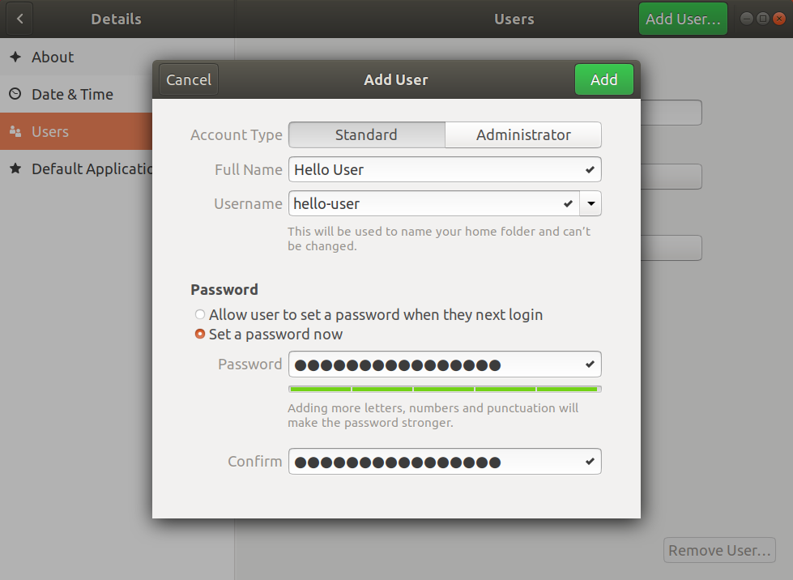

# Adding a New User

## Why

When multiple people are working with the robot, it can be helpful to create separate Ubuntu user accounts. Here's a few reasons you might add a new user:

 - Your code and data is protected by password in your user account
 - Your code is dependent on a specific version of Stretch's software and you don't want other users to accidentally upgrade it (NOTE: some of Stretch's software is installed per user, e.g. Stretch Body and Stretch ROS, whereas other parts of the software is installed per OS, e.g. ROS1 or ROS2)
 - Logs from your experiments will not be mixed with logs from other users

Finally, note that changes made in your user account can break another user account's set up. For example, if you configure a different gripper or end effector onto the robot with your account, other accounts will have outdated configurations for what gripper is attached to the robot.

## How

Login to the "hello-robot" user. The "hello-robot" user account has administrator privileges. Go to Users system settings and unlock the administrator actions.


Click "Add User..." and complete the subsequent form.



Logout and the log back in as the new user. Open a terminal and execute the following to pull down the Stretch Install repository.

```bash
cd ~
git clone https://github.com/hello-robot/stretch_install
cd stretch_install
git pull
```

Execute the following to set up the new user account with Stretch packages and the robot's configuration data.

```bash
./stretch_new_user_install.sh
```

Finally, reboot your robot and execute the following to confirm the new user account was set up successfully.

```bash
stretch_system_check.py
```

Your new user account is now set up successfully!

------
<div align="center"> All materials are Copyright 2020-2024 by Hello Robot Inc. Hello Robot and Stretch are registered trademarks.</div>
