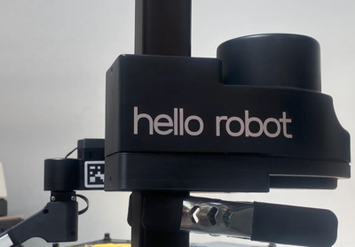

# Upgrading your Operating System

## Why

This guide will lead you through installing a new robot distribution, which can be used to:

 - Upgrade Stretch by installing a newer software stack alongside the previous OS
 - Erase the previous OS and set up Stretch with an entirely fresh software stack
 - Erase a corrupted OS and set up Stretch with an entirely fresh software stack

Each OS installs on a separate partition on the hard drive. You can create as many robot-level installs (i.e. new partitions) as will fit in your robot's hard drive.

The list of supported/deprecated distributions is available in the [Distributions & Roadmap](../../software/distributions/) guide.

## How

There are a few steps to performing a new robot install:

 1. Plug in charger & Attach clip-clamp
 2. Backup robot calibration data
 3. Setup the BIOS (only necessary for NUCs not previously configured by Hello Robot)
 4. Install Ubuntu
 5. Run the new robot installation script
 6. Post installation steps

It typically takes ~2 hours to go through these steps. Before we get started, you'll need:

 - 1 Stretch robot
 - Keyboard, Mouse, and Monitor
    - Bluetooth keyboards/mouses will not work because they are not recognized by the BIOS. Use a wired USB or wireless USB dongle keyboard/mouse.
    - Use a computer monitor instead of a TV. Some TVs have trouble displaying Ubuntu when rebooting.
 - 2 USB sticks
    - The first flashdrive is used to backup robot calibration data and any other important files
    - The second flashdrive will contain the Ubuntu installer image. This flashdrive will need to be >8gb in capacity.
 - 1 NOCO Genius 10 charger
 - 1 Clip Clamp
 - A fast connection to the internet

    !!! note

        It's recommended that you use an Ethernet connection to the internet. You can use a slow Wifi connection if it's difficult to obtain a wired connection at your institution, but expect the install process to take longer because the scripts are downloading gigabytes of software/data to the robot.

### Plug in charger & Attach clip-clamp

Since a new robot install can take a few hours, it's important the robot remain on the charger throughout the install. Switch the charger into SUPPLY mode and plug the charger into the robot.

{ loading=lazy }

Next, attach the clip-clamp below the shoulder as shown. This allows the arm to rest on the clamp during the firmware portion of the install.

### Back up robot calibration data

It is a good idea to backup all valuable data beforehand. If your new robot install will replace a previous one, **data from the previous robot install will be deleted.** Even if your new robot install will live alongside the previous one(s), **data from the previous robot install(s) can be lost.**

In particular, your new robot install will require the old install's robot calibration data. The steps to copy this material from an existing install is:

 1. Boot into the robot's original Ubuntu partition and plug in a USB key.
 2. The robot calibration data lives inside of a directory called `stretch-<yyy>-<xxxx>`, where `<yyy>` is your robot model number ("re1" for a Stretch RE1, "re2" for a Stretch 2, or "se3" for a Stretch 3), and `<xxxx>` is your robot's serial number. There's a few versions of this directory and you will need to decide which version to backup. Each Ubuntu user has a version of this directory located at `/home/$USER/stretch_user/stretch-<yyy>-<xxxx>`. These user versions are updated when the user runs a URDF calibration, swaps out an end effector, updates Stretch parameters, and more. There's also a system version located at `/etc/hello-robot/stretch-<yyy>-<xxxx>`, which is likely the oldest version since it was created at Hello Robot HQ. If you're not sure which version to backup, use the version at `/etc/hello-robot/stretch-<yyy>-<xxxx>` for the next step.
 3. Copy the `stretch-<yyy>-<xxxx>` directory to a USB key.
    - For example, if you're copying the system version, you can run a command similar to `cp -r /etc/hello-robot/stretch-<yyy>-<xxxx> /media/$USER/<USBKEY>` from the command line, where `<USBKEY>` and `<xxxx>` is replaced with the mounted USB key's name and the robot's serial number, respectively.
    - Or, you can open the file explorer to copy the directory.

If your previous partition is corrupted or inaccessible, contact Hello Robot support and they will be able to supply an older version of the `stretch-<yyy>-<xxxx>` directory.

### Setup the BIOS

This step can be skipped if your robot had an existing software install on it. Otherwise, follow the [guide to set up the BIOS](./configure_BIOS.md).

### Install Ubuntu

Choose between the following guides based on which version of Ubuntu you're installing (see the [Distributions & Roadmap](../../software/distributions/) guide for info on what software ships with each OS). Within these guides, you'll have the choice of whether to replace the previous OS partition or to install alongside it. If you choose to install alongside it, you'll also be able to choose the size of each partition on the hard drive.

 - [Ubuntu 18.04 Installation guide](./install_ubuntu_18.04.md)
 - [Ubuntu 20.04 Installation guide](./install_ubuntu_20.04.md)
 - [Ubuntu 22.04 Installation guide](./install_ubuntu_22.04.md)

After the Ubuntu install, the default `hello-robot` user account will be set up.

### Run the robot installation script

Login to the `hello-robot` user account on your new Ubuntu partition, open a terminal, and run:

```bash
sudo apt update
sudo apt install git zip
```

!!! note

    The system may not be able to run APT immediately after a reboot as the OS may be running automatic updates in the background. Typically, waiting 10-20 minutes will allow you to use APT again.

Next, place the robot's calibration data in the home folder using the following steps:

 1. Plug in the USB key that contains the backed up calibration data.
 2. Copy the `stretch-<yyy>-<xxxx>` directory from the USB key into the home folder (i.e. `/home/$USER/`).
    - For example, you can run a command similar to `cp -r /media/$USER/<USBKEY>/stretch-<yyy>-<xxxx> /home/$USER/` from the command line, where `<USBKEY>` and `<xxxx>` are replaced with your USB key's name and your robot's serial number, respectively.
    - Or, you can open the file explorer to copy the directory.

Next, use git to pull down the [Stretch Install](https://github.com/hello-robot/stretch_install) repository and begin the installation process:

```bash
cd ~/
git clone https://github.com/hello-robot/stretch_install
cd stretch_install
git pull
./stretch_new_robot_install.sh
```

Once the script has started, it will ask you for your robot's serial number, Y/N confirmation, and the password. Then, the script will typically take 20-30 minutes to complete on a wired connection. Once it finishes, it should print out something similar to:

```
#############################################
DONE! INSTALLATION COMPLETED SUCCESSFULLY.
[...]
#############################################
```

If it has not printed out 'DONE', then the robot install did not complete successfully. Take a look at the [troubleshooting](#troubleshooting) section below for solutions to common issues, or contact Hello Robot support via email or [the forum](https://forum.hello-robot.com/).

### Post install steps

Next, we'll complete the post install steps. First, in order for the many changes to take effect, the robot will need a full reboot. The steps are:

 1. Ensure there's a clamp under the lift
 2. Shutdown the Ubuntu OS through the GUI or use `sudo shutdown -h now` in the terminal
 3. Turn off the power switch in the robot's trunk
 4. Ensure a keyboard/monitor is plugged into the robot. When the robot powers up, you can use the keyboard to decide which OS to boot into.
 5. Turn on the power switch in the robot's trunk
 6. Boot into the new Ubuntu partition and log in if necessary

Next, we'll ensure the robot's firmware is upgraded to the latest available.

```{.bash .shell-prompt .copy}
REx_firmware_updater.py --install
```

Next, we'll configure the software for the tool attached to your robot.

```{.bash .shell-prompt .copy}
stretch_configure_tool.py
```

Next, we'll run Stretch's homing procedure, where every joint's zero is found. This is a ~30 second procedure that must occur everytime the robot wakes up.

```{.bash .shell-prompt .copy}
stretch_robot_home.py
```

Next, we'll calibrate the contact thresholds for the robot's arm joint.

```{.bash .shell-prompt .copy}
REx_calibrate_guarded_contact.py --arm
```

Next, we'll remove the clip-clamp and calibrate the contact thresholds for the robot's lift joint.

{ width="400" loading=lazy }

```{.bash .shell-prompt .copy}
REx_calibrate_guarded_contact.py --lift
```

Next, we'll run the system check to confirm the robot is ready to use. If you see any failures or errors, contact Hello Robot support via email or [the forum](https://forum.hello-robot.com/).

```{.bash .shell-prompt .copy}
stretch_system_check.py
```

Finally, this step is **optional**. The robot can be configured to automatically run the gamepad teleop program when it boots up. To do this, open Startup Applications and enable the "hello_robot_gamepad_teleop" program.

{ loading=lazy }

Your robot is now set up with a new operating system! If you're new to Stretch, consider going through the [Getting Started](../../getting_started/hello_robot/) tutorials.

---

## Troubleshooting

This section provides suggestions for common errors that occur during installation. If you become stuck and don't find an answer here, please email us or contact us through [the forum](https://forum.hello-robot.com/).

### 'Expecting var HELLO_FLEET_ID to be undefined' error

If you are seeing the following error:

```
[...]
Checking ~/.bashrc doesn't already define HELLO_FLEET_ID...
Expecting var HELLO_FLEET_ID to be undefined. Check end of ~/.bashrc file, delete all lines in 'STRETCH BASHRC SETUP' section, and open a new terminal. Exiting.

#############################################
FAILURE. INSTALLATION DID NOT COMPLETE.
[...]
```

You are performing a new robot install on a robot that has already gone through the robot install process. If this is intentional, you will need to manually delete lines that a previous robot install appended to the `~/.bashrc` dotfile. Open the `~/.bashrc` file in an editor and look near the end for a section that looks like:

```
######################
# STRETCH BASHRC SETUP
######################
export HELLO_FLEET_PATH=/home/ubuntu/stretch_user
export HELLO_FLEET_ID=stretch-re1-1000
export PATH=${PATH}:~/.local/bin
export LRS_LOG_LEVEL=None #Debug
source /opt/ros/noetic/setup.bash
source /home/ubuntu/catkin_ws/devel/setup.bash
[...]
```

Delete this section from the `~/.bashrc`. Note that it's common for other programs (e.g. Conda, Ruby) to append to your `~/.bashrc` as well, and deleting those lines accidentally can impede their functionality. Take care to only delete lines related to 'STRETCH BASHRC SETUP' section. Next, open a new terminal. Every new bash shell (i.e. the terminal you open when searching for 'Terminal' in system applications) automatically runs the commands in the `~/.bashrc` dotfile when opened, so the new terminal won't be set up with the lines that were just deleted. Now you can run a new robot install and this error should gone.

### 'Expecting stretch-yyy-xxxx to be present in the home folder' error

If you are seeing the following error:

```
[...]
Checking robot calibration data in home folder...
Expecting robot calibration stretch-yyy-xxxx to be present in the the home folder. Exiting.

#############################################
FAILURE. INSTALLATION DID NOT COMPLETE.
[...]
```

The install scripts exited before performing the robot install because it was unable to find the robot's calibration data folder, 'stretch-yyy-xxxx'. Please ensure you have [backed up your robot's calibration data](#back-up-robot-calibration-data) to a USB key and copied the 'stretch-yyy-xxxx' folder to the home folder of your new partition. See the [Run the robot installation script](#run-the-robot-installation-script) section for more details. Then, run the install scripts again and the error should be gone.

### 'Repo not up-to-date' error

If you are seeing the following error:

```
[...]
Checking install repo is up-to-date...
Repo not up-to-date. Please perform a 'git pull'. Exiting.

#############################################
FAILURE. INSTALLATION DID NOT COMPLETE.
[...]
```

The version of Stretch Install being used is out of date. In a terminal, go to the Stretch Install folder (should be in the home folder: `cd ~/stretch_install`), and perform a `git pull` to pull down the latest version. If the git pull fails, ensure Stretch Install has a clean working tree using `git status`. If you see any red files, save them if important, delete Stretch Install, and reclone it.

### 'Failed to fetch' error

If you are seeing the following error:

```
Install <some package>
E: Failed to fetch <url to some .deb file>  Connection failed [IP: <some IP address>]
E: Unable to fetch some archives, maybe run apt-get update or try with --fix-missing?

#############################################
FAILURE. INSTALLATION DID NOT COMPLETE.
[...]
```

Ubuntu's system package manager, Apt, has failed to contact the server that hosts some package that the install scripts need to download. Typically, these issues are transient and waiting some time before rerunning the install script will solve the issue.

### 'dpkg returned an error code' error

If you are seeing the following error:

```
Install <some package>
E: Sub-process /usr/bin/dpkg returned an error code (1)

#############################################
FAILURE. INSTALLATION DID NOT COMPLETE.
[...]
```

Ubuntu's system package manager, Apt, has failed to complete some step of the install process for a package that the install scripts need to install. Typically, these issues are transient and waiting some time before rerunning the install script will solve the issue. If you continue to see this error, contact Hello Robot support via email or [the forum](https://forum.hello-robot.com/).

### 'Firmware protocol mismatch' error

If you are seeing the following error:
```
----------------
Firmware protocol mismatch on hello-<X>.
Protocol on board is p<X>.
Valid protocol is: p<X>.
Disabling device.
Please upgrade the firmware and/or version of Stretch Body.
----------------
```

Your version of Stretch Body does not align with the firmware installed with your robot. It's recommended that Stretch Body is first upgraded to the latest version available (but if you're intentionally running an older version, you can skip this step and the firmware updater will downgrade your firmware appropriately). To upgrade Stretch Body, follow the [instructions here](../../software/updating_software/#python-libraries).

Next, run the firmware updater tool to automatically update the firmware to the required version for your software.

```
REx_firmware_updater.py --install
```

The firmware mismatch errors should now be gone.

------
<div align="center"> All materials are Copyright 2020-2024 by Hello Robot Inc. Hello Robot and Stretch are registered trademarks.</div>
